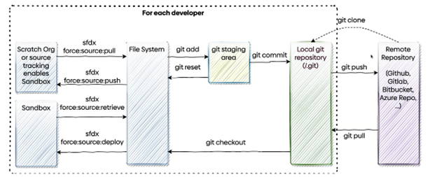

# Salesforce DX & Git

## Command-line CLI:

- “Pwd” – (check dir)
- “Ls” – (check folders or files in this dir)
- “Cd”
- “Cd ..” – (change dir one level up)
- “Mkdir xxx” – (create a folder)
- “Touch xxx” – (create the file)
- “Rm xxx” – (delete the file)
- “Rmdir xxx” – (delete the folder)
- “Move/cp <filename> <foldername> -(move/copy file) –(“..” one level up)
- “Mv <filename> <new name>” – (rename)
- “Code ./xxx” –(open xxx with vscode)

## Git

### Exiting project:

- “Git clone <url>” / "Git pull" - update to the newest vision
- “Git add <file>”
- “Git status” –(check status)
- “Git commit –m “meaningful message”
- "Git push"

### New project

- “Mkdir newproject” - create new folder
- “Cd newproject”
- “Git init”

“Git log” –(check the commit history)

“Git diff” – (check differents)

### Branch

- “Git checkout -b xxx” – (create new branch)
- "git checkout xxx" - (change to xxx branch)

## SFDX

- Step 1: git clone main branch from Github
- Step 2: create a branch using git checkout -b (name of the branch)
- Step 3: Go to the branch - (command idk)
- Step 3: Authorize dev org (sfdx auth:web:login )
- Step 4: Create scratch org (ctrl shift p - create scratch org/ sfdx force:org:create -s -f config/project-scratch-def.json -a Scratch_org_name)
- Step 5: Push info on scratch org ( sfdx force:source:push -u (username of scratch org))
- Step 6: Open the scratch org (main bulk of changes:sfdx force:org:open -u scratch_org_name)
- Step 7: Once everything is good pull from scratch org (sfdx force:source:pull - u (user))
- Step 8: git status / git add - filename (add the files that were changed)
- Step 9 : Git commit -m (message here)
- Step 10: git status/ git push
- Step 11: Go to github and create pull request
- Step 12 (if done and no more work on the branch is to be done (can do merge)
